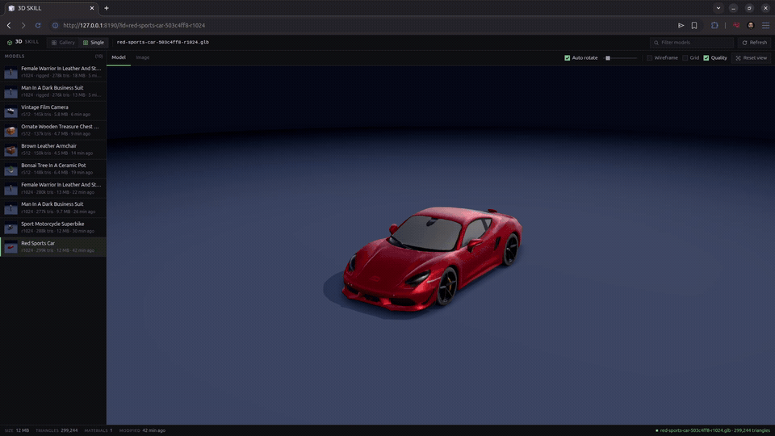
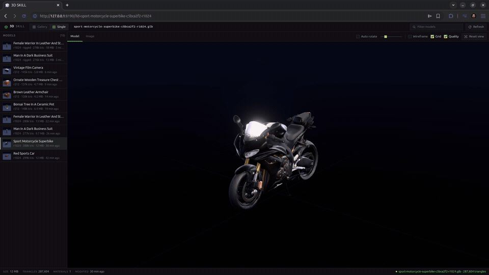
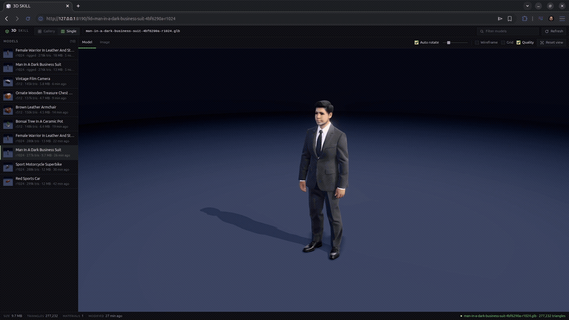
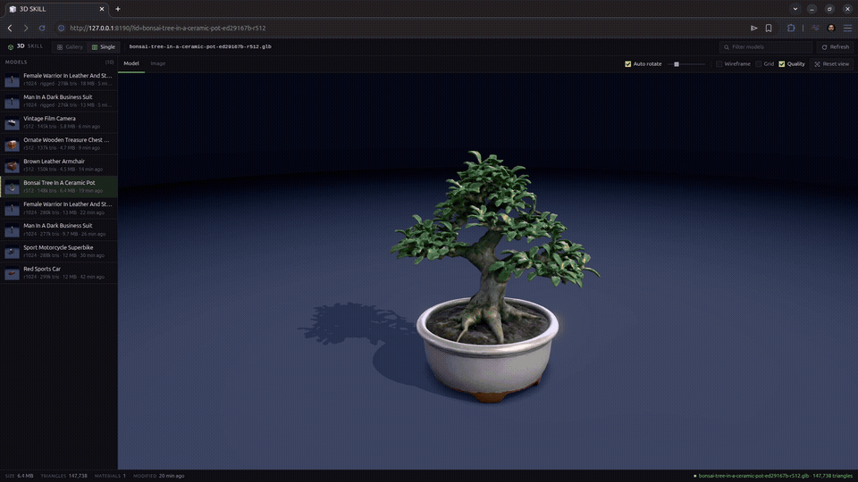

<h1 align="center">text-to-3D-skill</h1>

<table>
  <tr>
    <td align="center"><br><strong>Red sports car</strong></td>
    <td align="center"><br><strong>Sport motorcycle superbike</strong></td>
  </tr>
  <tr>
    <td align="center"><br><strong>Humanoid figures</strong></td>
    <td align="center"><br><strong>Bonsai tree</strong></td>
  </tr>
</table>

Type one subject description and get a textured static GLB generated locally on an AMD Strix Halo APU.

```text
prompt -> FLUX.2 klein (ComfyUI) -> PNG -> TRELLIS.2 (Vulkan) -> GLB
```

The screenshots above are four orders run through the toolkit: a red sports car, a sport motorcycle superbike, a humanoid figure, and a bonsai tree in a ceramic pot.

## What it does

FLUX.2 klein creates one reference image through the existing ComfyUI ROCm stack. TRELLIS.2 reconstructs that image into a textured GLB through a Vulkan-only container. `--target-faces` applies quadric simplification before UV unwrap for game and web budgets.

The output envelope contains the GLB path, byte size, sha256, triangle count, and stage timings. The GLB is parsed before success is reported: its container, JSON and BIN chunks, and mesh data must be valid.

This release produces static models. Blender, rigging, skeletons, and humanoid animation are outside the current toolkit.

## Install the skill

```text
/plugin marketplace add hec-ovi/text-to-3D-skill
/plugin install text-to-3d@text-to-3d-skill
/reload-plugins
```

For a checkout:

```bash
git clone git@github.com:hec-ovi/text-to-3D-skill.git
cd text-to-3D-skill
```

The installed skill includes `scripts/init.py`. If it is not running from a checkout, the launcher clones this toolkit into `~/.local/share/text-to-3d-toolkit`.

## Prerequisites

- AMD Strix Halo (gfx1151) with a recent amdgpu kernel.
- Docker with Compose and access to `/dev/dri` and `/dev/kfd`.
- A configured sibling checkout of `comfyui-strix-docker`.
- These ComfyUI weights under its models mount: `flux-2-klein-4b.safetensors`, `qwen_3_4b.safetensors`, and `flux2-vae.safetensors`.
- About 20 GB for the ten TRELLIS.2 GGUF files.
- Python 3.10 or newer. The drivers use only the standard library.

## Start the harness

```bash
python3 scripts/init.py
```

`init` is safe to run again. It verifies or fetches the TRELLIS weights, builds and starts ComfyUI, starts the resident Vulkan engine, starts the preview server, and waits for all three health checks. Its stdout is one validated JSON result.

The default paths can be changed:

```bash
python3 scripts/init.py \
  --comfy-dir /path/to/comfyui-strix-docker \
  --models-dir /path/to/trellis2-gguf \
  --out-dir /path/to/output
```

The first run builds containers, downloads missing weights, and loads the models. Later runs reuse the running services.

## Generate a model

```bash
python3 layers/pipeline/src/pipeline.py \
  --prompt "a brass antique diving helmet with round glass ports and copper fittings" \
  --out-dir out \
  --runner server
```

For a real-time asset, set a face target:

```bash
python3 layers/pipeline/src/pipeline.py \
  --prompt "a stylised red sports car" \
  --target-faces 12000 \
  --out-dir out \
  --runner server
```

Useful starting points:

- Small prop: 2K to 6K faces.
- Stylised full-body figure: 5K to 10K.
- Vehicle or hero asset: 20K to 50K.

Use resolution 1024 for full-body figures and 512 for compact props. A generated face works at gameplay distance, but the single-view reconstruction does not hold up as a portrait.

## Preview

Init serves the local gallery at:

```text
http://127.0.0.1:8190/
```

Open one model by its GLB file stem:

```text
http://127.0.0.1:8190/?id=<asset-id>
```

The viewer is self-contained. Its three.js files are vendored, and it reads models directly from the output directory.

## Why MCP was discarded

For practicality, the MCP transport was discarded. The protocol process duplicated schemas and wrapped local commands that the agent can already run directly.

The skill now starts the harness on demand through `init`, waits until the services are ready, and calls each layer CLI itself. ComfyUI, TRELLIS.2, and the preview stay hot for the rest of the session without an MCP server between the agent and the toolkit.

## Layers

| Layer | Contract |
| --- | --- |
| Start and health-check the harness | [`layers/init/CONTRACT.md`](layers/init/CONTRACT.md) |
| Text to reference image | [`layers/text2image/CONTRACT.md`](layers/text2image/CONTRACT.md) |
| Image to textured GLB | [`layers/image2mesh/CONTRACT.md`](layers/image2mesh/CONTRACT.md) |
| Text-to-GLB stage order | [`layers/pipeline/CONTRACT.md`](layers/pipeline/CONTRACT.md) |
| Local browser preview | [`layers/preview/CONTRACT.md`](layers/preview/CONTRACT.md) |

Each layer validates JSON envelopes at its boundary and imports no sibling internals. Binary assets cross layers by path, media type, byte size, and sha256.

## Tests

```bash
scripts/test.sh
```

The default suite uses stand-ins for ComfyUI, Docker, and the GPU engine while exercising the real CLI entry points. Run the real GPU mesh test with:

```bash
T2M_RUN_GPU=1 scripts/test.sh image2mesh
```

The preview has server tests plus Testing Library user-interaction tests:

```bash
cd layers/preview
npm install
npm test
```

Measured on the Strix Halo host after a fresh build: init reached all three health endpoints in 853 seconds. The prompt `a small blue ceramic teapot with a curved spout, loop handle, and round lid` then produced its 1024 PNG in 514.6 seconds and a 3,982-triangle, 229,420-byte GLB in 154.2 seconds. The bundled viewer loaded and rendered the result.

## Limits

- One subject per generation, not a multi-object scene.
- Static GLBs only.
- No Blender, rigging, skeleton, or animation path.
- Vulkan GPU required. CPU fallback is refused.

## License

MIT.
