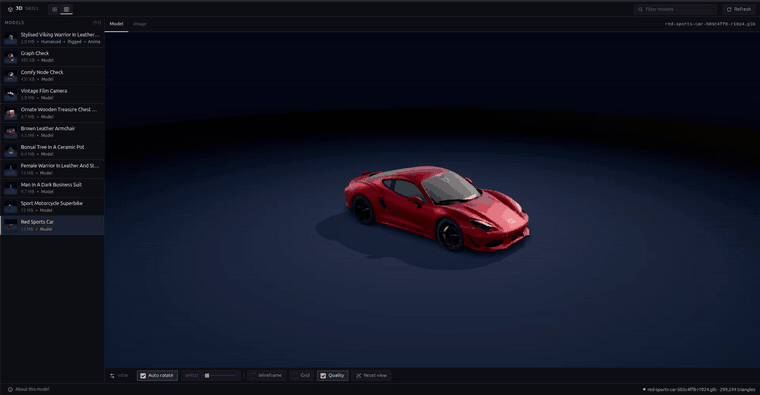
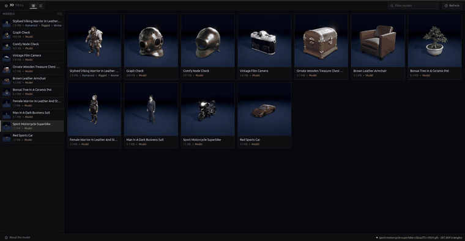

<h1 align="center">text-to-3D-skill</h1>

<p align="center">
  <a href="LICENSE"></a>
  <a href=".claude-plugin/marketplace.json"></a>
  <a href="#prerequisites"></a>
  <a href="layers/image2mesh/engine/PROVENANCE.md"></a>
  <a href="#prerequisites"></a>
  <a href="#rig-a-character"></a>
  <a href="#times-on-this-box"></a>
</p>

Type one subject description and get a textured GLB, generated on your own machine. A humanoid can then be rigged and given clips on that same machine. Nothing leaves the box, nothing needs an NVIDIA card, and Blender is not installed anywhere in it.

```text
   "a female warrior in polished steel plate armour"
                        |
                        v
        FLUX.2 klein  (ComfyUI, ROCm)
                        |
                        v
                    reference PNG
                        |
                        v
        TRELLIS.2  (C++ engine, Vulkan)
                        |
                        v
                  textured GLB
                        |
                        v            <-- humanoids only
        SkinTokens  (PyTorch, ROCm)
                        |
                        v
      rigged GLB: 34 Mixamo bones, idle + walk
```

> **Red sports car**

<p align="center">
  
</p>

> **Sport motorcycle, wireframe on**

<p align="center">
  
</p>

> **Bonsai tree in a ceramic pot**

<p align="center">
  
</p>

> **The gallery, and the motorcycle**

<p align="center">
  
</p>

## What it does

FLUX.2 klein renders one reference image through a ComfyUI stack on ROCm. TRELLIS.2 reconstructs that image into a textured GLB through a Vulkan-only container. `--target-faces` runs quadric simplification before the UV unwrap, so a budget costs file size and not detail: the texture is baked onto the mesh that survives.

A generated humanoid can then be rigged. SkinTokens predicts a skeleton and per-vertex weights, the driver names those joints Mixamo's way by reading the shape of the tree, and `idle` and `walk` are solved directly against that skeleton. There is no retargeting step, which is where a walk cycle comes out backwards. Skinning is appended to the GLB rather than rebuilt from it, so the materials and textures the reconstruction baked are the ones that come out.

Every stage returns a schema-validated JSON envelope, and every file is parsed before it is called a success.

## Why it runs at all on this hardware

None of the three models here ships a supported path to a Radeon iGPU. Each one needed a different answer.

**The mesh engine is C++.** TRELLIS.2's reference implementation is CUDA. This repo carries a trimmed fork of a C++/GGML port, built for Vulkan and nothing else: the CUDA and HIP kernels, the CUDA branches of the build, fifteen numeric test binaries, a Tauri desktop app and 115 MB of showcase assets are gone, taking 207 MB of checkout down to 1.8 MB of source. What is left runs on the render node alone, with no `/dev/kfd` and no ROCm, and refuses to fall back to the CPU rather than quietly taking twenty minutes. Two changes on top of upstream are documented with the measurement behind each: the decimation edge list was being built through one hash map on one thread, costing twice what the GPU did, and rebuilding it per vertex in parallel took the GLB write from 61.4 s to 30.1 s, **14.5% off the whole run**.

**The rig model is Python, and its blockers were not kernels.** SkinTokens documents NVIDIA, CUDA 12.1+ and flash-attn. Reading the source rather than the install notes: no `.cu` file, no compiled extension, nothing CUDA-only in `requirements.txt`. Two things actually stop it, and both are handled in the container without editing upstream. Four modules import `flash_attn_interface` with no fallback branch, so a shim supplies that module backed by torch SDPA, using the implementation their own code already carries elsewhere. And the Qwen3 backbone is built with `attn_implementation` hardcoded to `flash_attention_2`, which transformers refuses outright when the package is absent, so that one argument is rewritten to `sdpa`. Neither changes what is computed.

**Blender is not in the loop.** SkinTokens uses `bpy` as a mesh reader behind an abstract parser; the container feeds it through the `npz` loader it already supports, filled from the GLB itself. The rigged file is written by about four hundred lines of standard-library glTF: skin, inverse binds, joint nodes as TRS, animation samplers. It validates clean against the Khronos glTF-Validator.

**One container, if you want one.** The default is two: ComfyUI is privileged and holds `/dev/kfd`, the mesh engine has the render node and nothing else, and `init` hides both behind one command. A ComfyUI node ships in this repo so a single graph runs prompt to GLB, and a single-artifact image builds the engine into the ComfyUI one with a supervisor whose rule is that the container dies when either process does. That image is packaging, not performance: it costs the engine's sandbox and reloads the weights whenever ComfyUI restarts.

## Install the skill

```text
/plugin marketplace add hec-ovi/text-to-3D-skill
/plugin install text-to-3d@text-to-3d-skill
/reload-plugins
```

Codex reads the same skill through `.agents/plugins/marketplace.json`, which installs `plugins/text-to-3d-codex` and its `/text-to-3d` command.

For a checkout:

```bash
git clone git@github.com:hec-ovi/text-to-3D-skill.git
cd text-to-3D-skill
```

The installed skill includes `scripts/init.py`. If it is not running from a checkout, the launcher clones this toolkit into `~/.local/share/text-to-3d-toolkit`.

## Prerequisites

- AMD Strix Halo (gfx1151) with a recent amdgpu kernel.
- Docker with Compose and access to `/dev/dri` and `/dev/kfd`.
- A configured sibling checkout of `comfyui-strix-docker`.
- These ComfyUI weights under its models mount: `flux-2-klein-4b.safetensors`, `qwen_3_4b.safetensors`, and `flux2-vae.safetensors`.
- About 20 GB for the ten TRELLIS.2 GGUF files, and 1.6 GB for the SkinTokens checkpoints if you want rigging.
- Python 3.10 or newer. The drivers use only the standard library.

## Start the harness

```bash
python3 scripts/init.py
```

`init` is safe to run again. It verifies or fetches the TRELLIS weights, builds and starts ComfyUI, starts the resident Vulkan engine and the rig service, starts the preview server, and waits for every health check. Its stdout is one validated JSON result. `--no-rig` skips the rig service for a session that only makes meshes.

The default paths can be changed:

```bash
python3 scripts/init.py \
  --comfy-dir /path/to/comfyui-strix-docker \
  --models-dir /path/to/trellis2-gguf \
  --out-dir /path/to/output
```

The first run builds containers, downloads missing weights, and loads the models. Later runs reuse the running services.

## Generate a model

```bash
python3 layers/pipeline/src/pipeline.py \
  --prompt "a brass antique diving helmet with round glass ports and copper fittings" \
  --out-dir out \
  --runner server
```

For a real-time asset, set a face target:

```bash
python3 layers/pipeline/src/pipeline.py \
  --prompt "a stylised red sports car" \
  --target-faces 12000 \
  --out-dir out \
  --runner server
```

Useful starting points:

- Small prop: 2K to 6K faces.
- Stylised full-body figure: 5K to 10K.
- Vehicle or hero asset: 20K to 50K.

Use resolution 1024 for full-body figures and 512 for compact props. A generated face works at gameplay distance, but the single-view reconstruction does not hold up as a portrait.

## Rig a character

```bash
python3 layers/rig/src/rig.py --glb out/<character>-r1024.glb --out-dir out
```

Writes `<stem>-rigged.glb` with a Mixamo-named skeleton and `idle` and `walk`, in 13 seconds for an 11,168-vertex character. The output validates clean against the Khronos glTF-Validator: 0 errors, 0 warnings.

SkinTokens documents NVIDIA, CUDA 12.1+ and flash-attn. Its code needs none of that: there is no CUDA-only dependency and no compiled extension in it. Two things block it on AMD, and [`layers/rig/docker/`](layers/rig/docker/Dockerfile) handles both without editing upstream: a `flash_attn_interface` shim backed by torch SDPA, and one hardcoded `attn_implementation` argument rewritten to `sdpa`.

## Times on this box

AMD Ryzen AI Max+ (Strix Halo), Radeon 8060S, gfx1151, 128 GB unified. Every figure below is read off the envelope the run itself emitted, not estimated. Single runs: treat anything under 5% as noise.

| Step | What was run | Time |
| --- | --- | --- |
| Start the harness, cold | Both images to build, all weights to load | 853 s |
| Start the harness, warm | Images built, Compose converging | 38 s |
| Image, 1024 square | FLUX.2 klein, 4 steps, a ceramic teapot | 514.6 s |
| Image, 832x1216 portrait | The same model, character framing | 519.1 s |
| Mesh, res 512 | Default face target, weights resident | 154.2 s |
| Mesh, res 512, 8K faces | Cold model load inside the number, sharing the iGPU with a language model | 305.7 s |
| Mesh, res 1024, 12K faces | Warm, 1024 texture volume, 4096 atlas, 11,958 triangles out | 345.3 s |
| Mesh, res 1024, 12K faces | The same settings while the image model still held memory | 1084.4 s |
| Rig service, first start | SkinTokens checkpoints into memory | 15.1 s |
| Rig, 11,168 vertices | Skeleton and skin weights, 34 joints | 13.0 s |
| Rig, 13,407 vertices | The same, a second character | 11.5 s |
| Rig, same, contended | A language model resident on the same iGPU | 31.9 s |
| Naming, skinning, clips, write | Everything the driver does after the model answers | 0.1 s |

What that adds up to. A prop at 512 is about eleven minutes, nearly all of it the image. A character at 1024 is fifteen minutes when the mesh engine has memory to itself, and rigging it adds under fifteen seconds. The 1084 s row is the same work with the image model still resident: on a unified-memory part, what else is loaded matters more than the settings do.

The image stage is the surprise, and it is not this toolkit's code: klein is a 4-step distilled model and those four steps take eight and a half minutes on this part. The mesh is where the engine work went, and where [`layers/image2mesh/CHANGES.md`](layers/image2mesh/CHANGES.md) documents a 14.5% end-to-end win with the measurement behind each change.

Animation costs nothing worth measuring. The clips are solved from the skeleton in the driver, so they land inside the same tenth of a second as the skinning and the file write.

## Preview

Init serves the local gallery at:

```text
http://127.0.0.1:8190/
```

Open one model by its GLB file stem:

```text
http://127.0.0.1:8190/?id=<asset-id>
```

The viewer is self-contained. Its three.js files are vendored, and it reads models directly from the output directory.

## One graph in ComfyUI

`init` mounts a `TextTo3DMesh` node into the ComfyUI container and points it at the engine. Load [`layers/comfy/workflows/text_to_3d.json`](layers/comfy/workflows/text_to_3d.json) and the whole pipeline is one graph: klein renders the reference image, the node reconstructs it, and the GLB lands in the directory the preview server is already watching. `--no-comfy-node` starts ComfyUI without it.

The node is an HTTP client for the resident Vulkan server, not a port of TRELLIS into ComfyUI. The native nodes are not an option on this hardware: every maintained wrapper builds FlexGEMM, CuMesh, nvdiffrast and flash-attn, and Microsoft's own HIP path targets gfx942, not gfx1151.

Two containers is the default. [`layers/comfy/docker/`](layers/comfy/docker/Dockerfile) builds a single-artifact image with the engine inside the ComfyUI one, for when that is the requirement. It costs the engine's unprivileged sandbox and reloads the TRELLIS weights whenever ComfyUI restarts, and it makes nothing faster.

## Why MCP was discarded

For practicality, the MCP transport was discarded. The protocol process duplicated schemas and wrapped local commands that the agent can already run directly.

The skill now starts the harness on demand through `init`, waits until the services are ready, and calls each layer CLI itself. ComfyUI, TRELLIS.2, and the preview stay hot for the rest of the session without an MCP server between the agent and the toolkit.

## Layers

| Layer | Contract |
| --- | --- |
| Start and health-check the harness | [`layers/init/CONTRACT.md`](layers/init/CONTRACT.md) |
| Text to reference image | [`layers/text2image/CONTRACT.md`](layers/text2image/CONTRACT.md) |
| Image to textured GLB | [`layers/image2mesh/CONTRACT.md`](layers/image2mesh/CONTRACT.md) |
| Text-to-GLB stage order | [`layers/pipeline/CONTRACT.md`](layers/pipeline/CONTRACT.md) |
| The ComfyUI node and one-graph workflow | [`layers/comfy/CONTRACT.md`](layers/comfy/CONTRACT.md) |
| Skeleton, skinning and clips | [`layers/rig/CONTRACT.md`](layers/rig/CONTRACT.md) |
| Local browser preview | [`layers/preview/CONTRACT.md`](layers/preview/CONTRACT.md) |

Each layer validates JSON envelopes at its boundary and imports no sibling internals. Binary assets cross layers by path, media type, byte size, and sha256.

## Tests

```bash
scripts/test.sh
```

The default suite uses stand-ins for ComfyUI, Docker, and the GPU engine while exercising the real CLI entry points. Run the real GPU mesh test with:

```bash
T2M_RUN_GPU=1 scripts/test.sh image2mesh
```

The preview has server tests plus Testing Library user-interaction tests:

```bash
cd layers/preview
npm install
npm test
```

Timings for every stage are in [Times on this box](#times-on-this-box).

## Limits

- One subject per generation, not a multi-object scene.
- Rigging is for humanoids. A prop is refused rather than given a spine.
- Clips are generated, not hand-authored. They read as motion at gameplay distance and do not survive a close look; the skeleton is Mixamo-named so an authored pack plays on it without retargeting.
- Vulkan GPU for the mesh, ROCm for the rig. The mesh engine refuses CPU fallback.

## License

MIT.
